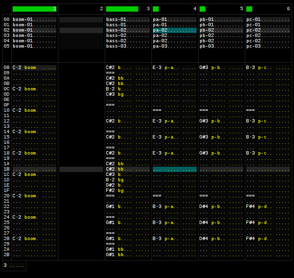

terminal-tracker
================

A ncurses-based chiptune tracker.
[Get a taste of what it sounds like.](https://soundcloud.com/daniel-langner-150098802/r-type-leo-area-2)

### Features:
+ simple ncurses pattern editor
+ neat chiptune-like sound
+ MIDI support (now even polyphonic)
+ instruments are defined externally via text editor
+ effects (echo)

### TODO:
+ documentation

Libs you'll need:
- `libncurses`
- `libSDL`
- `libportmidi`
- `libsndfile`

Try it out:

	$ git submodule init
	$ make
	$ ./tt tunes/area2.x	# press space to play
